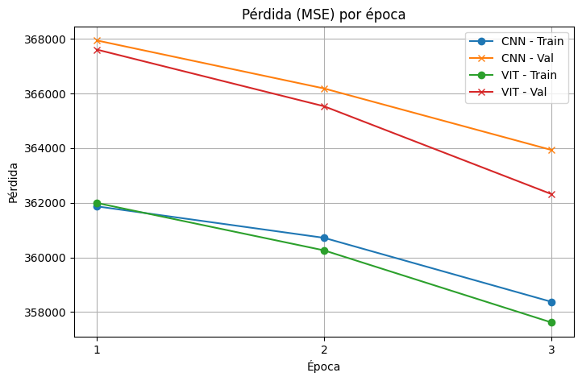
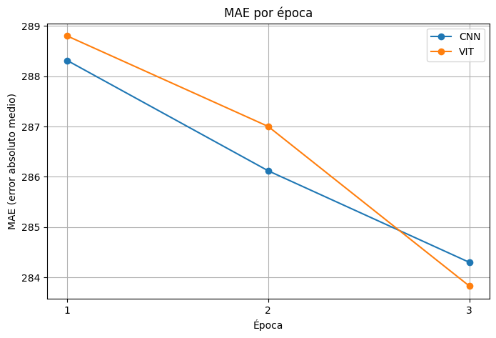

# NutritionVerse-CNN-ViT 

Este repositorio contiene únicamente un notebook de Colab para comparar dos modelos de regresión multivariable —una CNN basada en ResNet50 y un Vision Transformer (ViT)— sobre el dataset **NutritionVerse‑Real**.

---

## 📓 Contenido

- **Notebook**  
  `NutritionVerse_CNN_ViT.ipynb`  
  - Descarga y descompresión automática del dataset desde Kaggle.  
  - Preprocesamiento: fusión de metadatos, extracción de `dish_id`, splits `train`/`val`.  
  - Definición de `FoodDataset` en PyTorch.  
  - Implementación de:
    - **CNNRegressor** (ResNet50 + cabeza lineal 5 → salidas nutricionales)  
    - **ViTRegressor** (ViT Base + MLP de regresión 5 → salidas nutricionales)  
  - Bucle de entrenamiento de 3 épocas con MSELoss y optimizador Adam.  
  - Cálculo de métricas: MSE (train/val) y MAE (val).  
  - Visualización de curvas de pérdida y MAE.

---

## 🔧 Cómo usar

1. Abre el notebook en Colab:
   

2. Sube tu `kaggle.json` cuando el notebook lo solicite.

3. Ejecuta todas las celdas. El notebook descargará automáticamente el dataset y entrenará ambos modelos.

---

## 📊 Resultados principales

### Curvas de pérdida (MSE)

### Curvas de MAE

- **CNN**: MAE de 288.31 → 284.30  
- **ViT**: MAE de 288.80 → 283.83  

---

## 📌 Notas

- El notebook está pensado para ejecutarse en GPU (Colab).  
- Ajusta `batch_size`, número de épocas o data augmentation directamente desde las celdas.  
- Puedes clonar este repo y abrir el `.ipynb` localmente si lo prefieres.

